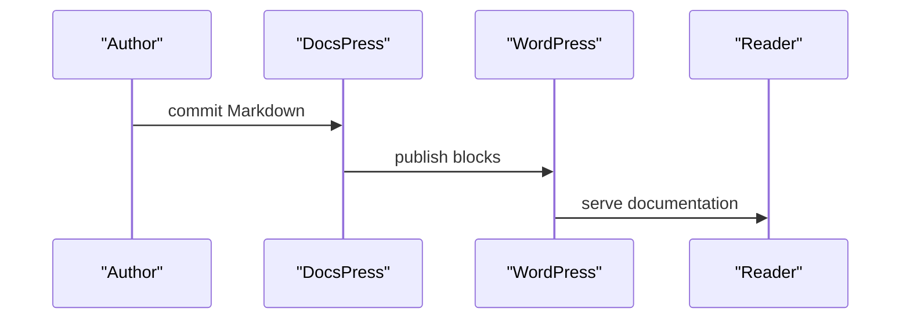
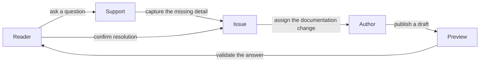
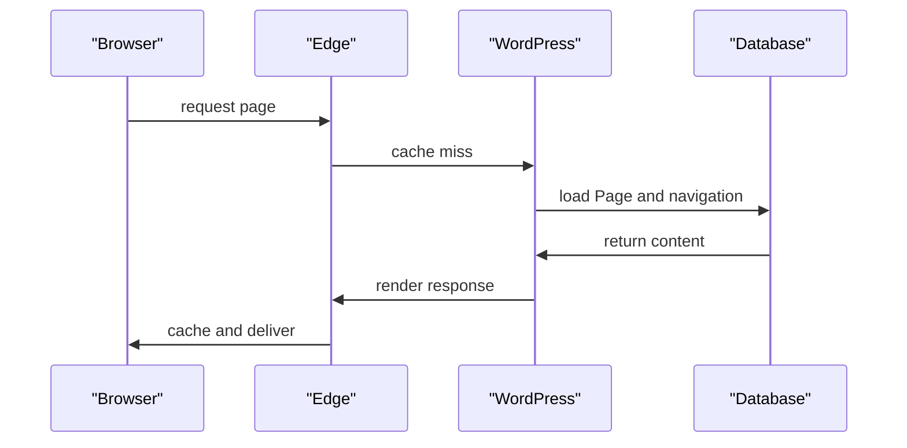

Use `docspress/diagram` to turn a compact relationship list into a flow or sequence diagram. GitHub renders the Markdown preview as Mermaid, while WordPress renders a theme-native accessible SVG without loading a browser diagram library.

## When to use it

Choose Diagram when the relationship among actors is harder to understand in prose. Use [Flow](flow.md) for instructions readers perform and [File Tree](file-tree.md) for hierarchy. For a large architecture, split the subject into several focused diagrams.

## Write diagram source

Write one relationship per line:

```text
Source -> Target: optional label
```

A lone colon starts the label, so a double colon stays part of an actor name: `mantle_init -> Bootstrap::run: instantiate` links `mantle_init` to `Bootstrap::run`.

Lines beginning with `#` are comments. The parser considers the first 30 source lines and renders at most eight actors and 24 relationships. Extra relationships are discarded, so keep the model deliberately small.

DocsPress generates the Mermaid syntax; keep authoring the compact relationship format above. A `flow` diagram becomes a `flowchart LR`, and a `sequence` diagram becomes a `sequenceDiagram`.

## Attributes

<!-- docspress:block
{
  "version": 1,
  "name": "docspress/fields",
  "attrs": {
    "title": "Diagram attributes",
    "description": "Labels and relationship source accepted by \u003ccode\u003edocspress/diagram\u003c/code\u003e.",
    "fields": [
      {
        "name": "title",
        "type": "string",
        "required": false,
        "defaultValue": "Publishing flow",
        "description": "\u003cp\u003ePlain-text heading and accessible diagram label.\u003c/p\u003e",
        "values": "",
        "deprecated": false
      },
      {
        "name": "type",
        "type": "enum",
        "required": false,
        "defaultValue": "flow",
        "description": "\u003cp\u003eVisual arrangement of actors and connections.\u003c/p\u003e",
        "values": "flow, sequence",
        "deprecated": false
      },
      {
        "name": "source",
        "type": "string",
        "required": true,
        "defaultValue": "Starter relationships",
        "description": "\u003cp\u003eOne \u003ccode\u003eSource -\u003e Target: label\u003c/code\u003e relationship per line.\u003c/p\u003e",
        "values": "First 30 lines, 8 actors, 24 relationships",
        "deprecated": false
      },
      {
        "name": "caption",
        "type": "string",
        "required": false,
        "defaultValue": "",
        "description": "\u003cp\u003eOptional formatted explanation below the SVG.\u003c/p\u003e",
        "values": "",
        "deprecated": false
      }
    ],
    "searchable": false,
    "compact": true
  }
}
-->
#### Diagram attributes

Labels and relationship source accepted by <code>docspress/diagram</code>.

| Field | Type | Required | Default | Description |
| --- | --- | --- | --- | --- |
| `title` | string | No | Publishing flow | <p>Plain-text heading and accessible diagram label.</p> |
| `type` | enum | No | flow | <p>Visual arrangement of actors and connections.</p> |
| `source` | string | Yes | Starter relationships | <p>One <code>Source -> Target: label</code> relationship per line.</p> |
| `caption` | string | No |  | <p>Optional formatted explanation below the SVG.</p> |
<!-- /docspress:block -->

The block supports `wide` alignment in addition to the [shared design controls](index.md#add-and-edit-a-block).

## Creative examples

### Documentation publishing sequence

<!-- docspress:block
{
  "version": 1,
  "name": "docspress/diagram",
  "attrs": {
    "title": "Documentation publishing flow",
    "type": "sequence",
    "source": "Author -\u003e DocsPress: commit Markdown\nDocsPress -\u003e WordPress: publish blocks\nWordPress -\u003e Reader: serve documentation",
    "caption": "The source remains concise and editable in Gutenberg."
  }
}
-->
#### Documentation publishing flow



_The source remains concise and editable in Gutenberg._
<!-- /docspress:block -->

### Reader feedback loop

<!-- docspress:block
{
  "version": 1,
  "name": "docspress/diagram",
  "attrs": {
    "title": "From reader question to verified improvement",
    "type": "flow",
    "source": "Reader -\u003e Support: ask a question\nSupport -\u003e Issue: capture the missing detail\nIssue -\u003e Author: assign the documentation change\nAuthor -\u003e Preview: publish a draft\nPreview -\u003e Reader: validate the answer\nReader -\u003e Issue: confirm resolution",
    "caption": "A feedback loop makes the reader part of documentation quality."
  }
}
-->
#### From reader question to verified improvement



_A feedback loop makes the reader part of documentation quality._
<!-- /docspress:block -->

### Cache-miss request sequence

<!-- docspress:block
{
  "version": 1,
  "name": "docspress/diagram",
  "attrs": {
    "title": "What happens on a documentation cache miss",
    "type": "sequence",
    "source": "Browser -\u003e Edge: request page\nEdge -\u003e WordPress: cache miss\nWordPress -\u003e Database: load Page and navigation\nDatabase -\u003e WordPress: return content\nWordPress -\u003e Edge: render response\nEdge -\u003e Browser: cache and deliver",
    "caption": "The sequence keeps infrastructure actors and response direction explicit."
  }
}
-->
#### What happens on a documentation cache miss



_The sequence keeps infrastructure actors and response direction explicit._
<!-- /docspress:block -->

## Published behavior and accessibility

On GitHub, DocsPress projects the compact source into a fenced `mermaid` block so the repository view renders the diagram. In WordPress, DocsPress produces a theme-native SVG with an image role and accessible label. Labels are escaped for each target syntax and remain in the authoritative config. No third-party diagram code runs on the WordPress page.

Use distinct actor names, short edge labels, and one direction of reading. Describe the important conclusion in nearby prose so the page does not depend on vision alone.
