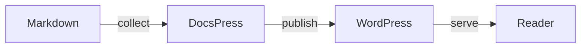
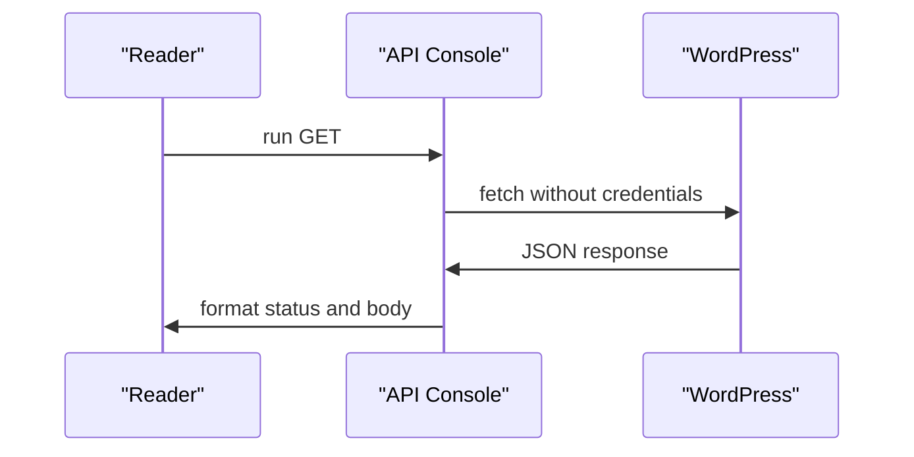

This Page is the acceptance surface for the DocsPress theme and all fifteen DocsPress Blocks. Switch Global Style variations and light/dark mode while checking native color, typography, spacing, border, dimensions, interactions, and content controls.

<!-- docspress:block
{
  "version": 1,
  "name": "docspress/callout",
  "attrs": {
    "tone": "note",
    "title": "Playground acceptance page",
    "content": "\u003cp\u003eThe local Playground appends its live component inventory to this source-backed Page after seeding it.\u003c/p\u003e",
    "collapsible": false
  }
}
-->
> [!NOTE]
>
> **Playground acceptance page**
>
> The local Playground appends its live component inventory to this source-backed Page after seeding it.
<!-- /docspress:block -->

## Audience Paths

<!-- docspress:block
{
  "version": 1,
  "name": "docspress/audience-paths",
  "attrs": {
    "compact": true,
    "eyebrow": "Compact · three columns",
    "title": "Where are your docs today?",
    "description": "Independent documentation roots can meet readers at the state of their repository.",
    "paths": [
      {
        "title": "I already have Markdown docs",
        "description": "Connect an existing docs folder and begin with a safe draft sync.",
        "url": "/docs/publish-existing-docs/",
        "cta": "Publish existing docs",
        "icon": "document",
        "accent": "blue",
        "newTab": false
      },
      {
        "title": "I need to create docs",
        "description": "Generate source-grounded documentation with AI before publishing.",
        "url": "/docs/create-docs-with-ai/",
        "cta": "Create docs with AI",
        "icon": "sparkles",
        "accent": "gold",
        "newTab": false
      },
      {
        "title": "I'm evaluating DocsPress",
        "description": "Review the product benefits and open a working preview before changing a repository.",
        "url": "/docs/why-docspress/",
        "cta": "Explore why DocsPress",
        "icon": "compass",
        "accent": "green",
        "newTab": false
      }
    ],
    "columns": 3,
    "tone": "ink",
    "textAlign": "left",
    "showNumbers": true
  }
}
-->
_Compact · three columns_

## Where are your docs today?

Independent documentation roots can meet readers at the state of their repository.

### I already have Markdown docs

Connect an existing docs folder and begin with a safe draft sync.

[Publish existing docs](/docs/publish-existing-docs/)

### I need to create docs

Generate source-grounded documentation with AI before publishing.

[Create docs with AI](/docs/create-docs-with-ai/)

### I'm evaluating DocsPress

Review the product benefits and open a working preview before changing a repository.

[Explore why DocsPress](/docs/why-docspress/)
<!-- /docspress:block -->

<!-- docspress:block
{
  "version": 1,
  "name": "docspress/audience-paths",
  "attrs": {
    "compact": true,
    "eyebrow": "Compact · one column",
    "title": "One route, one clear next step",
    "description": "A focused path keeps its icon, copy, and action on one shared left edge.",
    "paths": [
      {
        "title": "Publish an existing documentation tree",
        "description": "Connect Markdown that already lives beside the code, preview the Page hierarchy, and publish when it is ready.",
        "url": "/docs/publish-existing-docs/",
        "cta": "Publish existing docs",
        "icon": "document",
        "accent": "blue",
        "newTab": false
      }
    ],
    "columns": 1,
    "tone": "paper",
    "textAlign": "left",
    "showNumbers": false
  }
}
-->
_Compact · one column_

## One route, one clear next step

A focused path keeps its icon, copy, and action on one shared left edge.

### Publish an existing documentation tree

Connect Markdown that already lives beside the code, preview the Page hierarchy, and publish when it is ready.

[Publish existing docs](/docs/publish-existing-docs/)
<!-- /docspress:block -->

<!-- docspress:block
{
  "version": 1,
  "name": "docspress/audience-paths",
  "attrs": {
    "compact": false,
    "eyebrow": "Standard · two columns",
    "title": "Choose how the documentation begins",
    "description": "Compare two equally weighted routes without changing the established two-column treatment.",
    "paths": [
      {
        "title": "Bring maintained Markdown",
        "description": "Connect a reviewed docs folder and synchronize it with WordPress Pages.",
        "url": "/docs/publish-existing-docs/",
        "cta": "Connect existing docs",
        "icon": "document",
        "accent": "green",
        "newTab": false
      },
      {
        "title": "Generate docs from source",
        "description": "Use source-grounded agent skills to create a reviewable documentation tree.",
        "url": "/docs/create-docs-with-ai/",
        "cta": "Generate documentation",
        "icon": "sparkles",
        "accent": "gold",
        "newTab": false
      }
    ],
    "columns": 2,
    "tone": "theme",
    "textAlign": "left",
    "showNumbers": true
  }
}
-->
_Standard · two columns_

## Choose how the documentation begins

Compare two equally weighted routes without changing the established two-column treatment.

### Bring maintained Markdown

Connect a reviewed docs folder and synchronize it with WordPress Pages.

[Connect existing docs](/docs/publish-existing-docs/)

### Generate docs from source

Use source-grounded agent skills to create a reviewable documentation tree.

[Generate documentation](/docs/create-docs-with-ai/)
<!-- /docspress:block -->

## Colorful Code

<!-- docspress:block
{
  "version": 1,
  "name": "docspress/colorful-code",
  "attrs": {
    "language": "yaml",
    "filename": ".github/workflows/sync-docs.yml",
    "code": "name: Sync docs\non:\n  push:\n    paths: [\"docs/**\"]\nsteps:\n  - uses: Automattic/docspress@COMMIT_SHA",
    "highlightedLines": "2-4,6",
    "showLineNumbers": true,
    "caption": "Filename, language, line numbers, highlighted ranges, caption, and copy."
  }
}
-->
**.github/workflows/sync-docs.yml — Filename, language, line numbers, highlighted ranges, caption, and copy.**

```yaml
name: Sync docs
on:
  push:
    paths: ["docs/**"]
steps:
  - uses: Automattic/docspress@COMMIT_SHA
```
<!-- /docspress:block -->

<!-- docspress:block
{
  "version": 1,
  "name": "docspress/colorful-code",
  "attrs": {
    "language": "plaintext",
    "filename": "Without line numbers",
    "code": "Markdown in.\nWordPress out.",
    "highlightedLines": "",
    "showLineNumbers": false,
    "caption": "Plain text with line numbers disabled."
  }
}
-->
**Without line numbers — Plain text with line numbers disabled.**

```plaintext
Markdown in.
WordPress out.
```
<!-- /docspress:block -->

<!-- docspress:block
{
  "version": 1,
  "name": "docspress/colorful-code",
  "attrs": {
    "language": "json",
    "filename": "page-response.diff",
    "code": "@@ page 43 @@\n-  \"status\": \"draft\"\n+  \"status\": \"publish\"\n+  \"modified\": \"2026-07-27T07:40:00Z\"",
    "highlightedLines": "",
    "showLineNumbers": true,
    "caption": "Unified diff colors, final-state copy, and line-level explanations.",
    "diffMode": "unified",
    "copyMode": "final",
    "annotations": [
      {
        "line": 3,
        "content": "\u003cp\u003eThe published status is the value retained by \u003cstrong\u003eCopy\u003c/strong\u003e.\u003c/p\u003e"
      },
      {
        "line": 4,
        "content": "\u003cp\u003eThe modification time comes from the live response.\u003c/p\u003e"
      }
    ]
  }
}
-->
**page-response.diff — Unified diff colors, final-state copy, and line-level explanations.**

```json
@@ page 43 @@
-  "status": "draft"
+  "status": "publish"
+  "modified": "2026-07-27T07:40:00Z"
```
<!-- /docspress:block -->

## Code Tabs

<!-- docspress:block
{
  "version": 1,
  "name": "docspress/code-tabs",
  "attrs": {
    "tabs": [
      {
        "label": "npm",
        "language": "bash",
        "filename": "Terminal",
        "code": "npm install docspress"
      },
      {
        "label": "pnpm",
        "language": "bash",
        "filename": "Terminal",
        "code": "pnpm add docspress"
      },
      {
        "label": "Yarn",
        "language": "bash",
        "filename": "Terminal",
        "code": "yarn add docspress"
      },
      {
        "label": "Bun",
        "language": "bash",
        "filename": "Terminal",
        "code": "bun add docspress"
      },
      {
        "label": "JavaScript",
        "language": "javascript",
        "filename": "example.js",
        "code": "console.log('DocsPress');"
      },
      {
        "label": "PHP",
        "language": "php",
        "filename": "example.php",
        "code": "\u003c?php echo 'DocsPress';"
      },
      {
        "label": "Python",
        "language": "python",
        "filename": "example.py",
        "code": "print('DocsPress')"
      },
      {
        "label": "JSON",
        "language": "json",
        "filename": "example.json",
        "code": "{ \"name\": \"DocsPress\" }"
      }
    ],
    "showLineNumbers": false,
    "caption": "The maximum eight compact tabs with independent labels, languages, filenames, and code."
  }
}
-->
#### npm — Terminal

```bash
npm install docspress
```

#### pnpm — Terminal

```bash
pnpm add docspress
```

#### Yarn — Terminal

```bash
yarn add docspress
```

#### Bun — Terminal

```bash
bun add docspress
```

#### JavaScript — example.js

```javascript
console.log('DocsPress');
```

#### PHP — example.php

```php
<?php echo 'DocsPress';
```

#### Python — example.py

```python
print('DocsPress')
```

#### JSON — example.json

```json
{ "name": "DocsPress" }
```

_The maximum eight compact tabs with independent labels, languages, filenames, and code._
<!-- /docspress:block -->

## Callouts

<!-- docspress:block
{
  "version": 1,
  "name": "docspress/callout",
  "attrs": {
    "tone": "note",
    "title": "Note",
    "content": "\u003cp\u003eNeutral context that belongs beside the current step.\u003c/p\u003e",
    "collapsible": false
  }
}
-->
> [!NOTE]
>
> **Note**
>
> Neutral context that belongs beside the current step.
<!-- /docspress:block -->

<!-- docspress:block
{
  "version": 1,
  "name": "docspress/callout",
  "attrs": {
    "tone": "tip",
    "title": "Tip",
    "content": "\u003cp\u003eA useful shortcut or recommended practice.\u003c/p\u003e",
    "collapsible": false
  }
}
-->
> [!TIP]
>
> **Tip**
>
> A useful shortcut or recommended practice.
<!-- /docspress:block -->

<!-- docspress:block
{
  "version": 1,
  "name": "docspress/callout",
  "attrs": {
    "tone": "warning",
    "title": "Warning",
    "content": "\u003cp\u003eA condition readers should check before continuing.\u003c/p\u003e",
    "collapsible": false
  }
}
-->
> [!WARNING]
>
> **Warning**
>
> A condition readers should check before continuing.
<!-- /docspress:block -->

<!-- docspress:block
{
  "version": 1,
  "name": "docspress/callout",
  "attrs": {
    "tone": "danger",
    "title": "Danger",
    "content": "\u003cp\u003eA destructive or security-sensitive action.\u003c/p\u003e",
    "collapsible": false
  }
}
-->
> [!CAUTION]
>
> **Danger**
>
> A destructive or security-sensitive action.
<!-- /docspress:block -->

<!-- docspress:block
{
  "version": 1,
  "name": "docspress/callout",
  "attrs": {
    "tone": "success",
    "title": "Success",
    "content": "\u003cp\u003eA confirmed positive state or completed milestone.\u003c/p\u003e",
    "collapsible": false
  }
}
-->
> [!TIP]
>
> **Success**
>
> A confirmed positive state or completed milestone.
<!-- /docspress:block -->

<!-- docspress:block
{
  "version": 1,
  "name": "docspress/callout",
  "attrs": {
    "tone": "note",
    "title": "Collapsible and open",
    "content": "\u003cp\u003eReaders can hide this longer explanation.\u003c/p\u003e",
    "collapsible": true,
    "open": true
  }
}
-->
> [!NOTE]
>
> **Collapsible and open**
>
> Readers can hide this longer explanation.
<!-- /docspress:block -->

<!-- docspress:block
{
  "version": 1,
  "name": "docspress/callout",
  "attrs": {
    "tone": "tip",
    "title": "Collapsible and closed",
    "content": "\u003cp\u003eThis content begins hidden and remains keyboard accessible.\u003c/p\u003e",
    "collapsible": true,
    "open": false
  }
}
-->
> [!TIP]
>
> **Collapsible and closed**
>
> This content begins hidden and remains keyboard accessible.
<!-- /docspress:block -->

## Flow

<!-- docspress:block
{
  "version": 1,
  "name": "docspress/flow",
  "attrs": {
    "start": 1,
    "steps": [
      {
        "title": "Template",
        "content": "\u003cp\u003eChoose \u003ccode\u003efull\u003c/code\u003e or \u003ccode\u003eempty\u003c/code\u003e for the starting content.\u003c/p\u003e"
      },
      {
        "title": "Deploy target",
        "content": "\u003cp\u003eSelect the host that matches the project environment.\u003c/p\u003e"
      },
      {
        "title": "Install dependencies",
        "content": "\u003cp\u003eLet the package manager finish, then verify the generated site.\u003c/p\u003e"
      }
    ]
  }
}
-->
1. **Template**

   Choose `full` or `empty` for the starting content.

2. **Deploy target**

   Select the host that matches the project environment.

3. **Install dependencies**

   Let the package manager finish, then verify the generated site.
<!-- /docspress:block -->

## Diagram

<!-- docspress:block
{
  "version": 1,
  "name": "docspress/diagram",
  "attrs": {
    "title": "Documentation publishing flow",
    "type": "flow",
    "source": "Markdown -\u003e DocsPress: collect\nDocsPress -\u003e WordPress: publish\nWordPress -\u003e Reader: serve",
    "caption": "A flow diagram rendered as accessible, theme-native SVG without a third-party runtime."
  }
}
-->
#### Documentation publishing flow



_A flow diagram rendered as accessible, theme-native SVG without a third-party runtime._
<!-- /docspress:block -->

<!-- docspress:block
{
  "version": 1,
  "name": "docspress/diagram",
  "attrs": {
    "title": "Runnable request lifecycle",
    "type": "sequence",
    "source": "Reader -\u003e API Console: run GET\nAPI Console -\u003e WordPress: fetch without credentials\nWordPress -\u003e API Console: JSON response\nAPI Console -\u003e Reader: format status and body",
    "caption": "Sequence mode uses the same compact, editable relationship syntax."
  }
}
-->
#### Runnable request lifecycle



_Sequence mode uses the same compact, editable relationship syntax._
<!-- /docspress:block -->

## API Request / Response

<!-- docspress:block
{
  "version": 1,
  "name": "docspress/api-request",
  "attrs": {
    "method": "GET",
    "endpoint": "/wp-json/",
    "headers": "Accept: application/json",
    "requestBody": "",
    "requestBodyFormat": "json",
    "responseStatus": "200 OK",
    "responseBody": "{\n  \"name\": \"DocsPress\",\n  \"namespaces\": [\"wp/v2\"]\n}",
    "responseBodyFormat": "json",
    "runnable": true,
    "editable": true,
    "allowUnsafe": false,
    "baseUrl": "",
    "allowedOrigins": "",
    "timeout": 10000
  }
}
-->
<details>
<summary><strong>Request:</strong> <code>GET /wp-json/</code></summary>

**Headers**

```http
Accept: application/json
```

</details>

<details>
<summary><strong>Response:</strong> <code>200 OK</code></summary>

**Body**

```json
{
  "name": "DocsPress",
  "namespaces": ["wp/v2"]
}
```

</details>
<!-- /docspress:block -->

<!-- docspress:block
{
  "version": 1,
  "name": "docspress/api-request",
  "attrs": {
    "method": "POST",
    "endpoint": "/wp-json/wp/v2/pages",
    "headers": "Content-Type: application/json\nAuthorization: Bearer $WP_ACCESS_TOKEN",
    "requestBody": "{\n  \"title\": \"API reference\",\n  \"status\": \"draft\"\n}",
    "requestBodyFormat": "json",
    "responseStatus": "201 Created",
    "responseBody": "{\n  \"id\": 43,\n  \"status\": \"draft\"\n}",
    "responseBodyFormat": "json"
  }
}
-->
<details>
<summary><strong>Request:</strong> <code>POST /wp-json/wp/v2/pages</code></summary>

**Headers**

```http
Content-Type: application/json
Authorization: Bearer $WP_ACCESS_TOKEN
```

**Body**

```json
{
  "title": "API reference",
  "status": "draft"
}
```

</details>

<details>
<summary><strong>Response:</strong> <code>201 Created</code></summary>

**Body**

```json
{
  "id": 43,
  "status": "draft"
}
```

</details>
<!-- /docspress:block -->

<!-- docspress:block
{
  "version": 1,
  "name": "docspress/api-request",
  "attrs": {
    "method": "PUT",
    "endpoint": "/wp-json/wp/v2/pages/43",
    "headers": "Content-Type: application/x-www-form-urlencoded",
    "requestBody": "title=REST+API+Reference",
    "requestBodyFormat": "raw",
    "responseStatus": "200 OK",
    "responseBody": "Updated page 43: REST API Reference",
    "responseBodyFormat": "raw"
  }
}
-->
<details>
<summary><strong>Request:</strong> <code>PUT /wp-json/wp/v2/pages/43</code></summary>

**Headers**

```http
Content-Type: application/x-www-form-urlencoded
```

**Body**

```text
title=REST+API+Reference
```

</details>

<details>
<summary><strong>Response:</strong> <code>200 OK</code></summary>

**Body**

```text
Updated page 43: REST API Reference
```

</details>
<!-- /docspress:block -->

<!-- docspress:block
{
  "version": 1,
  "name": "docspress/api-request",
  "attrs": {
    "method": "PATCH",
    "endpoint": "/wp-json/wp/v2/pages/43",
    "headers": "Content-Type: application/json",
    "requestBody": "{ \"status\": \"publish\" }",
    "requestBodyFormat": "json",
    "responseStatus": "200 OK",
    "responseBody": "{ \"id\": 43, \"status\": \"publish\" }",
    "responseBodyFormat": "json"
  }
}
-->
<details>
<summary><strong>Request:</strong> <code>PATCH /wp-json/wp/v2/pages/43</code></summary>

**Headers**

```http
Content-Type: application/json
```

**Body**

```json
{ "status": "publish" }
```

</details>

<details>
<summary><strong>Response:</strong> <code>200 OK</code></summary>

**Body**

```json
{ "id": 43, "status": "publish" }
```

</details>
<!-- /docspress:block -->

<!-- docspress:block
{
  "version": 1,
  "name": "docspress/api-request",
  "attrs": {
    "method": "DELETE",
    "endpoint": "/wp-json/wp/v2/pages/43?force=true",
    "headers": "Authorization: Bearer $WP_ACCESS_TOKEN",
    "requestBody": "",
    "requestBodyFormat": "raw",
    "responseStatus": "204 No Content",
    "responseBody": "",
    "responseBodyFormat": "raw"
  }
}
-->
<details>
<summary><strong>Request:</strong> <code>DELETE /wp-json/wp/v2/pages/43?force=true</code></summary>

**Headers**

```http
Authorization: Bearer $WP_ACCESS_TOKEN
```

</details>

<details>
<summary><strong>Response:</strong> <code>204 No Content</code></summary>

</details>
<!-- /docspress:block -->

## Fields / Schema

<!-- docspress:block
{
  "version": 1,
  "name": "docspress/fields",
  "attrs": {
    "title": "Publish options",
    "description": "Typed request fields, defaults, constraints, and lifecycle states remain scannable as the reference grows.",
    "fields": [
      {
        "name": "site",
        "type": "string",
        "required": true,
        "defaultValue": "",
        "description": "WordPress site domain or numeric site ID.",
        "values": "",
        "deprecated": false
      },
      {
        "name": "status",
        "type": "enum",
        "required": false,
        "defaultValue": "draft",
        "description": "Publication status for synchronized Pages.",
        "values": "draft, publish, private",
        "deprecated": false
      },
      {
        "name": "dryRun",
        "type": "boolean",
        "required": false,
        "defaultValue": "false",
        "description": "Preview reconciliation without writing changes.",
        "values": "true, false",
        "deprecated": false
      },
      {
        "name": "legacyMode",
        "type": "boolean",
        "required": false,
        "defaultValue": "",
        "description": "Use the pre-block-theme publishing pipeline.",
        "values": "true, false",
        "deprecated": true
      }
    ],
    "searchable": true,
    "compact": false
  }
}
-->
#### Publish options

Typed request fields, defaults, constraints, and lifecycle states remain scannable as the reference grows.

| Field | Type | Required | Default | Description |
| --- | --- | --- | --- | --- |
| `site` | string | Yes |  | WordPress site domain or numeric site ID. |
| `status` | enum | No | draft | Publication status for synchronized Pages. |
| `dryRun` | boolean | No | false | Preview reconciliation without writing changes. |
| `legacyMode` | boolean | No |  | Use the pre-block-theme publishing pipeline. |
<!-- /docspress:block -->

## Terminal Session

<!-- docspress:block
{
  "version": 1,
  "name": "docspress/terminal-session",
  "attrs": {
    "title": "Run package verification",
    "shell": "bash",
    "prompt": "$",
    "command": "npm run package",
    "output": "Lint passed\nTests passed\nAction bundle rebuilt"
  }
}
-->
#### Run package verification

```bash
$ npm run package
```

**Output**

```text
Lint passed
Tests passed
Action bundle rebuilt
```
<!-- /docspress:block -->

<!-- docspress:block
{
  "version": 1,
  "name": "docspress/terminal-session",
  "attrs": {
    "title": "Inspect the site",
    "shell": "wp-cli",
    "prompt": "\u003e",
    "command": "wp option get docspress_playground_runtime \u002d\u002dformat=json",
    "output": ""
  }
}
-->
#### Inspect the site

```wp-cli
> wp option get docspress_playground_runtime --format=json
```
<!-- /docspress:block -->

## Live Code Playground

<!-- docspress:block
{
  "version": 1,
  "name": "docspress/code-playground",
  "attrs": {
    "title": "Interactive publish button",
    "html": "\u003cbutton class=\"demo-button\"\u003ePublish docs\u003c/button\u003e\n\u003cp class=\"status\" aria-live=\"polite\"\u003eReady\u003c/p\u003e",
    "css": ".demo-button {\n  padding: 0.75rem 1rem;\n  border: 0;\n  border-radius: 0.4rem;\n  background: #3858e9;\n  color: white;\n  font: inherit;\n}\n.status { font-family: ui-monospace, monospace; }",
    "javascript": "const button = document.querySelector( '.demo-button' );\nbutton.addEventListener( 'click', () =\u003e {\n  document.querySelector( '.status' ).textContent = 'Published';\n  console.log( 'Documentation published' );\n} );",
    "height": 340,
    "autoRun": true,
    "showConsole": true,
    "allowNetwork": false
  }
}
-->
#### Interactive publish button

**HTML**

```html
<button class="demo-button">Publish docs</button>
<p class="status" aria-live="polite">Ready</p>
```

**CSS**

```css
.demo-button {
  padding: 0.75rem 1rem;
  border: 0;
  border-radius: 0.4rem;
  background: #3858e9;
  color: white;
  font: inherit;
}
.status { font-family: ui-monospace, monospace; }
```

**JavaScript**

```javascript
const button = document.querySelector( '.demo-button' );
button.addEventListener( 'click', () => {
  document.querySelector( '.status' ).textContent = 'Published';
  console.log( 'Documentation published' );
} );
```
<!-- /docspress:block -->

## Result

<!-- docspress:block
{
  "version": 1,
  "name": "docspress/result",
  "attrs": {
    "status": "success",
    "title": "All checks passed",
    "content": "\u003cp\u003eThe generated Pages match the repository tree.\u003c/p\u003e",
    "meta": "20 pages"
  }
}
-->
> [!TIP]
>
> **All checks passed**
>
> The generated Pages match the repository tree.
>
> _20 pages_
<!-- /docspress:block -->

<!-- docspress:block
{
  "version": 1,
  "name": "docspress/result",
  "attrs": {
    "status": "neutral",
    "title": "No changes required",
    "content": "\u003cp\u003eWordPress already matches the current commit.\u003c/p\u003e",
    "meta": "0 updates"
  }
}
-->
> [!NOTE]
>
> **No changes required**
>
> WordPress already matches the current commit.
>
> _0 updates_
<!-- /docspress:block -->

<!-- docspress:block
{
  "version": 1,
  "name": "docspress/result",
  "attrs": {
    "status": "warning",
    "title": "Drafts need review",
    "content": "\u003cp\u003eThree new Pages are waiting for editorial approval.\u003c/p\u003e",
    "meta": "3 drafts"
  }
}
-->
> [!WARNING]
>
> **Drafts need review**
>
> Three new Pages are waiting for editorial approval.
>
> _3 drafts_
<!-- /docspress:block -->

<!-- docspress:block
{
  "version": 1,
  "name": "docspress/result",
  "attrs": {
    "status": "error",
    "title": "Synchronization failed",
    "content": "\u003cp\u003eThe access token cannot create Pages on this site.\u003c/p\u003e",
    "meta": "HTTP 403"
  }
}
-->
> [!CAUTION]
>
> **Synchronization failed**
>
> The access token cannot create Pages on this site.
>
> _HTTP 403_
<!-- /docspress:block -->

## File Tree

<!-- docspress:block
{
  "version": 1,
  "name": "docspress/file-tree",
  "attrs": {
    "root": "Automattic/docspress/",
    "tree": ".claude/\n  skills/\ndocs/\n  index.md\n  publish-existing-docs/\n  create-docs-with-ai/\n  reference/\n    kitchen-sink.md\nplugins/\n  docspress-blocks/\ntheme/\npackage.json",
    "caption": "Nested folders, files, a custom root label, and caption.",
    "collapsible": true,
    "open": true
  }
}
-->
#### Automattic/docspress/

```text
.claude/
  skills/
docs/
  index.md
  publish-existing-docs/
  create-docs-with-ai/
  reference/
    kitchen-sink.md
plugins/
  docspress-blocks/
theme/
package.json
```

_Nested folders, files, a custom root label, and caption._
<!-- /docspress:block -->

<!-- docspress:block
{
  "version": 1,
  "name": "docspress/file-tree",
  "attrs": {
    "root": "docs/",
    "tree": "index.md\nguides/\n  continuous-sync.md\nreference/\n  gutenberg-blocks/\n    index.md\n    api-request.md\n    fields.md\ntroubleshooting.md",
    "caption": "A compact tree that begins collapsed.",
    "collapsible": true,
    "open": false
  }
}
-->
#### docs/

```text
index.md
guides/
  continuous-sync.md
reference/
  gutenberg-blocks/
    index.md
    api-request.md
    fields.md
troubleshooting.md
```

_A compact tree that begins collapsed._
<!-- /docspress:block -->

## Prompt

<!-- docspress:block
{
  "version": 1,
  "name": "docspress/prompt",
  "attrs": {
    "prompt": "Explain DocsPress to a new contributor in three short paragraphs.",
    "model": "GPT-5",
    "mode": "chat",
    "thinking": false,
    "context": "@documentation, https://github.com/Automattic/docspress",
    "caption": "Contributor explainer"
  }
}
-->
#### Contributor explainer

> Explain DocsPress to a new contributor in three short paragraphs.

_Model: GPT-5 · Mode: chat · Thinking: off · Context: @documentation, https://github.com/Automattic/docspress_
<!-- /docspress:block -->

<!-- docspress:block
{
  "version": 1,
  "name": "docspress/prompt",
  "attrs": {
    "prompt": "Review the synchronization function for race conditions. Return risks first, then the smallest safe patch.",
    "model": "Claude Sonnet",
    "mode": "code",
    "thinking": true,
    "context": "@repository, src/sync.js, test/sync.test.js, #trace",
    "caption": "Race-condition review"
  }
}
-->
#### Race-condition review

> Review the synchronization function for race conditions. Return risks first, then the smallest safe patch.

_Model: Claude Sonnet · Mode: code · Thinking: on · Context: @repository, src/sync.js, test/sync.test.js, #trace_
<!-- /docspress:block -->

<!-- docspress:block
{
  "version": 1,
  "name": "docspress/prompt",
  "attrs": {
    "prompt": "Which Action inputs affect the generated WordPress Page hierarchy?",
    "model": "Gemini Pro",
    "mode": "ask",
    "thinking": false,
    "context": "action.yml, src/docs.js",
    "caption": "Configuration question"
  }
}
-->
#### Configuration question

> Which Action inputs affect the generated WordPress Page hierarchy?

_Model: Gemini Pro · Mode: ask · Thinking: off · Context: action.yml, src/docs.js_
<!-- /docspress:block -->

<!-- docspress:block
{
  "version": 1,
  "name": "docspress/prompt",
  "attrs": {
    "prompt": "Use $docspress-install to create a phased migration plan from a static documentation site to DocsPress.",
    "model": "Planning agent",
    "mode": "plan",
    "thinking": true,
    "context": "$docspress-install, docs/, #architecture, https://example.com/current-docs",
    "caption": "Migration plan with a skill reference"
  }
}
-->
#### Migration plan with a skill reference

> Use $docspress-install to create a phased migration plan from a static documentation site to DocsPress.

_Model: Planning agent · Mode: plan · Thinking: on · Context: $docspress-install, docs/, #architecture, https://example.com/current-docs_
<!-- /docspress:block -->

## Interactive Troubleshooter

<!-- docspress:block
{
  "version": 1,
  "name": "docspress/troubleshooter",
  "attrs": {
    "title": "Choose the right publishing workflow",
    "intro": "Answer two quick questions to reach a source-grounded next step.",
    "startId": "source",
    "questions": [
      {
        "id": "source",
        "question": "Do you already have Markdown documentation?",
        "yesLabel": "Yes, the docs exist",
        "yesNext": "connected",
        "noLabel": "Not yet",
        "noNext": "generate"
      },
      {
        "id": "connected",
        "question": "Is the repository connected to WordPress?",
        "yesLabel": "Yes, it is connected",
        "yesNext": "sync",
        "noLabel": "No, connect it",
        "noNext": "install"
      }
    ],
    "outcomes": [
      {
        "id": "install",
        "status": "warning",
        "title": "Connect the publishing target",
        "content": "\u003cp\u003eRun the DocsPress installer, add the WordPress access token, and verify the repository connection before publishing.\u003c/p\u003e"
      },
      {
        "id": "sync",
        "status": "success",
        "title": "Publish the documentation",
        "content": "\u003cp\u003eRun the sync command, review the proposed changes, and verify the rendered documentation on WordPress.\u003c/p\u003e"
      },
      {
        "id": "generate",
        "status": "neutral",
        "title": "Generate a documentation starter",
        "content": "\u003cp\u003eGenerate a small documentation tree from the source, then review every example against the implementation before publishing.\u003c/p\u003e"
      }
    ],
    "showProgress": true
  }
}
-->
## Choose the right publishing workflow

Answer two quick questions to reach a source-grounded next step.

- **Do you already have Markdown documentation?** — Yes, the docs exist / Not yet
- **Is the repository connected to WordPress?** — Yes, it is connected / No, connect it

### Connect the publishing target

Run the DocsPress installer, add the WordPress access token, and verify the repository connection before publishing.

### Publish the documentation

Run the sync command, review the proposed changes, and verify the rendered documentation on WordPress.

### Generate a documentation starter

Generate a small documentation tree from the source, then review every example against the implementation before publishing.
<!-- /docspress:block -->

<!-- docspress:block
{
  "version": 1,
  "name": "docspress/result",
  "attrs": {
    "status": "success",
    "title": "Kitchen Sink complete",
    "content": "\u003cp\u003eEvery DocsPress documentation block, semantic variant, and meaningful option is represented on this Page. Hero and Audience Paths are the design-focused landing blocks.\u003c/p\u003e",
    "meta": "13 documentation blocks · 2 landing blocks"
  }
}
-->
> [!TIP]
>
> **Kitchen Sink complete**
>
> Every DocsPress documentation block, semantic variant, and meaningful option is represented on this Page. Hero and Audience Paths are the design-focused landing blocks.
>
> _13 documentation blocks · 2 landing blocks_
<!-- /docspress:block -->

## Playground runtime

This inventory is generated from the running WordPress installation.

| Component | Type | Version | Status |
| --- | --- | --- | --- |
| WordPress | Core | 7.0.2 | Running |
| DocsPress | Theme | 0.10.7 | Active |
| Akismet Anti-spam: Spam Protection | Plugin | 5.7 | Active |
| DocsPress Blocks | Plugin | 0.10.7 | Active |
| Jetpack | Plugin | 16.1-a.3 | Active |
